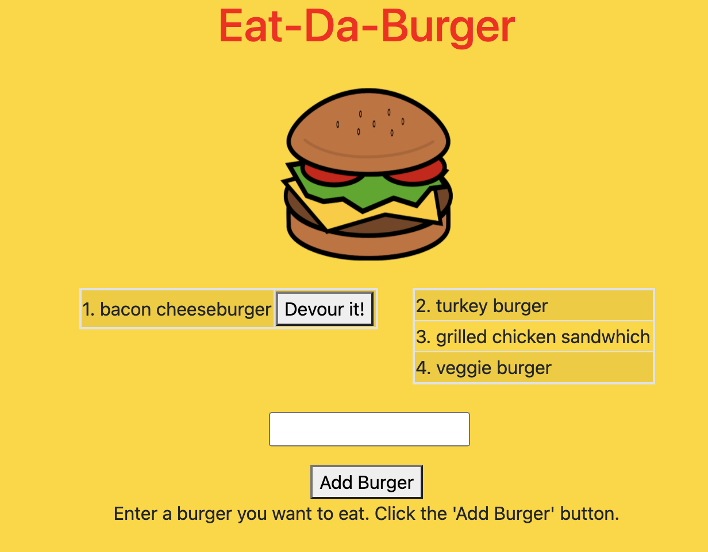

# Eat_Da_Burger

  ## Table of Contents

  * [Description](#description)
  * [Installation](#installation)
  * [Technologies-Used](#technologies-used)
  * [Deployed-Link](#deployed-link)
  * [Usage](#usage)
  * [Images](#images)
  * [Questions](#questions)
  * [Contributions](#contributions)
  * [License](#license)

  ## Description

  The motivation for this project was the desire to use the Model-View-Controller (MVC) Paradigm to create an application. This application uses an Express server with a MySQL database. The application retrieves information from the database to display in the app. New data can be added to the database and updated, as well. The information in the database is dynamically displayed using Handlebars.

  The purpose of this application is to let users input the names of burgers they would like to eat. When a burger is added it shows up on the left side of the page waiting to be devoured. The user can then devour each burger and it will then show up on the right side of the page.

  ## Installation

  No prior installations are required to use this application. The deployed link for the application is provided below.

  ## Technologies-Used

  * [Node.js](https://nodejs.dev/)
  * [Express.js](https://expressjs.com/)
  * [MySQL](https://www.mysql.com/)
  * [jawsDB](https://www.jawsdb.com/)
  * [Handlebars](https://handlebarsjs.com/)
  * [Bootstrap](https://getbootstrap.com/)
  * [jQuery](https://jquery.com/)

  ## Deployed-Link

  [Eat-Da-Burger](https://eatdaburger777.herokuapp.com/)

  ## Usage
  
  1. Input the name of a burger that you would like to eat in the text box, and click the 'Add Burger' button.
  1. The burger will then show up on the left side as it is yet to be eaten.
  1. Click the 'Devout it!' button next to the burger you would like to eat. The burger will then move to the right.

  ## Images
  ### Application Image
  

  ## Questions  

  If you have any questions you can reach me at martin7mondaca@gmail.com or via my GitHub [martinmondaca](https://github.com/martinmondaca)

  ## Contributions

  For any contributionns you can reach me at martin7mondaca@gmail.com or via my GitHub [martinmondaca](https://github.com/martinmondaca)

  ## License

  Licensed under [MIT](https://choosealicense.com/licenses/mit/) license.